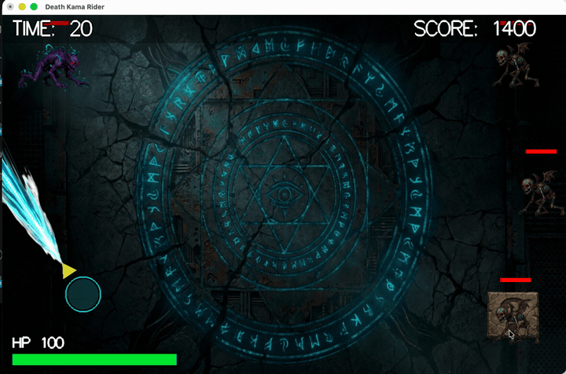
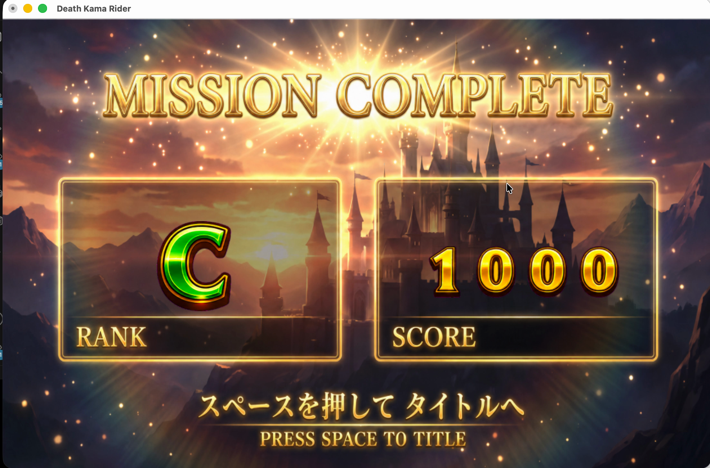

# Camagame_rider — 鎌ゲーム 再構築プロジェクト

> 旧プロジェクト `デジタルコンテンツ演習（授業版）` を全面的に再設計・整理した版。  
> 旧コードからの移動は行わず、**複製・リファクタリング**として進めています。

---

## デモ

**通しプレイ（WAVE1 → 2 → 3 → クリア）**



**ボス討伐戦（WAVE3）**


**ミッションコンプリート（クリア時にランク・スコアを表示）**



---

## 現在のステータス

- ✅ **WAVE1 → 2 → 3（ボス）→ クリア/ゲームオーバーまで通してプレイ可能**
- 🕹 **M5StickC や LiDAR が無くても、キーボードで遊べます**（下記）

---

## 遊び方（PC・キーボードで試す）

> ⚠️ ビルドは **macOS向け**（OpenGL / GLUT / OpenAL を使用）。

```bash
./run.sh        # PC版（1画面・キーボード操作）をビルドして起動
./run.sh expo   # 展示用2画面（M5Stick・LiDAR使用）で起動
```

**操作**

| キー | 動作 |
|------|------|
| ← ↑ ↓ → | 移動（歩いた方向を自動で向く） |
| A | 縦振り（強攻撃・射程 長） |
| S | 横振り（範囲攻撃・射程 短） |
| その場で立ち止まる | 防御（前方の弾を反射する） |
| SPACE | 画面送り（タイトル→ルール→プレイ）／WAVE突入演出・ヘルプ表示からの復帰 |
| K | 入力モード切替（キーボード ⇔ M5Stick） |
| D | デバッグ表示の ON/OFF |
| Z | デバッグ用スキップ（次の演出／ステージへ） |

**画面内の案内**

- 各WAVEの床の右下にあるマークを踏むと、そのWAVEの遊び方が全画面で表示される（表示中はバトル一時停止。SPACEで再開）
- WAVE2突入時は「攻撃封印」、WAVE3突入時は「攻撃解放」の演出が入り、SPACEを押すと戦闘が始まる
- WAVE2は鎌攻撃が封印され、立ち止まりガードで弾を跳ね返して倒す（案内は日本語で表示）
- PC版では足元に現在地マーカー（光るリング＋向き矢印）が表示される

WAVE1 → 2 → 3（ボス）を倒してクリアを目指す。設計の詳細は [`docs/GAME_DESIGN.md`](docs/GAME_DESIGN.md)。

---

## M5Stick（鎌コントローラ）で遊ぶ場合

```bash
cp .env.example .env    # 設定ファイルを作成
ls /dev/cu.*            # M5Stickを接続してポート名を確認
# 確認したポート名を .env の M5STICK_PORT に設定
./run.sh expo           # 展示用2画面で起動
```

ポート未設定・未接続のときは自動でキーボード操作になります。

---

## プロジェクト概要

| 項目 | 内容 |
|------|------|
| ゲーム形式 | 2Dアクション（OpenGL + GLUT） |
| コントローラ | M5StickC（鎌に取り付け、シリアル通信） |
| 位置追跡 | LiDAR（足元の検出） |
| 表示 | PC版：1画面 ／ 展示版：2画面（床面＝ゲーム本体・壁面＝スコアなどのUI） |
| 言語 | C++11（OpenGL）、Arduino C（M5Stick） |

---

## ディレクトリ構造

```
Camagame_rider/
├── README.md              ← このファイル
├── RULES.md               ← ルールブック（コーディング規約・運用ルール）
├── docs/
│   └── project_notes.ts   ← 設計メモ・型定義・課題トラッキング
├── arduino/
│   └── m5stick_sender/
│       └── m5stick_sender.ino  ← M5Stickのスケッチ（必ずセットで管理）
└── cgprog/
    ├── main.cpp           ← ゲーム本体
    ├── stb_image.h        ← 画像読み込みライブラリ
    └── assets/            ← 画像・音声ファイル
```

> ※ LiDAR連携用のバイナリ・設定は、設置環境専用のため本リポジトリには含みません（キーボードで遊ぶ分には不要）。

---

## 旧プロジェクトの課題・反省点

> ⚠️ **この節の詳細コードは古い `main1画面.cpp` 基準です。**    
> **最終的な分析の正本は [`docs/project_notes.ts`](docs/project_notes.ts) の BUGS 配列**（main.cpp基準）を参照。

### 【最重要】プレイヤーの向きが定まらない（向きの二重制御）

「歩いた方向にガードが向かない」の主因。`playerAngle`（向き）を2つの仕組みが同時に書き換えていて競合している。

```cpp
// (1) ジャイロZによる回転 (1072-1074行)
if (fabs(stick_gyro_Z) > deadzone_gyro_rot) {
    playerAngle -= stick_gyro_Z * 0.03;   // コントローラのひねりで回す
}

// (2) LiDAR移動方向による回転 (1141-1147行)
if (moveDist > 5.0) {
    float moveAngle = atan2(dy, dx) * 180.0 / M_PI;
    playerAngle += angleDiff * 0.1;       // 歩いた方向に少しずつ向く
}
```

歩きながらコントローラに少しでもヨー回転やドリフトがあると、2つが引っ張り合って向きが定まらない。  
→ **向きの決定方法を1つに統一する**（「歩いた方向に向く」が目的なら、ジャイロZの回転は外す）

---

### 【高】防御判定が二重に書かれていて競合する

当初これを「`{}`省略バグ」と記録したが、**それは誤りだった**（実際はブレースは正しく付いている）。  
精読し直した結果、本当の問題は防御判定が2か所にあり競合していることだった。

```cpp
// ブロックA (1123-1127): M5Stickの静止で防御を決める
if (isAlmostStill && isStickQuiet && ...) { isDefending = true; ... }
else { isDefending = false; }

// ブロックB (1158-1160): LiDARの静止で防御を「上書き」する（後から実行）
if (lidarStillTimer > 30 && ...) { if (!isDefending) isDefending = true; ... }
else { isDefending = false; }
```

- ブロックBが後から実行され、Aの結果を毎フレーム捨てる → **Aは実質デッドコード**
- Aは防御音を鳴らすが、その後Bが`isDefending=false`に戻すことがある → **「音は鳴るのに防御していない」**
- LiDARがノイズで揺れると`lidarStillTimer`が30に達せず、**防御が全く発動しなくなる**

→ 防御判定を1か所に統一し、トリガーを明確にして書き直す

---

### 【構造問題】`timer()` 関数が肥大化

旧コードの `timer()` は約1000行に及び、以下がすべて混在していた：

- M5Stickの入力処理
- LiDARファイルの読み込み
- ゲームロジック（敵AI・弾・アイテム）
- WAVE管理
- プレイヤー向きの計算

→ 新プロジェクトでは **役割ごとに関数分割** する（`RULES.md` 参照）

---

### 【センサー問題】M5Stickの軸と取り付け向きの不一致

M5StickCを鎌に取り付ける際、物理的な「縦振り・横振り」とジャイロX/Y軸の対応が取り付け角度によって変わる。

旧コードでは val[] のインデックスとセンサー軸の対応が以下のように想定されていたが、実際の取り付け向きで確認されていなかった：

| val[] | 想定 | 実際の確認状態 |
|-------|------|----------------|
| val[0] | acc_x（傾き左右） | 未確認 |
| val[1] | acc_y（傾き前後） | 未確認 |
| val[2] | acc_z（重力方向） | 未確認 |
| val[3] | gyro_x → **縦振り** | 未確認 |
| val[4] | gyro_y → **横振り** | 未確認 |
| val[5] | gyro_z → **水平回転** | 未確認 |

→ 新プロジェクトでは **デバッグ表示モード（`d`キー）** で全センサー値をリアルタイム表示し、実際に振って確認してから閾値を設定する。

---

### 【依存問題】LiDARとゲームの起動順序

旧プロジェクトでは起動手順が文書化されておらず：
1. LiDARアプリを先に起動しないと `footpoint.txt` が更新されない
2. ゲームが先に起動すると `footNum=0` のまま始まり、プレイヤーが動かない

→ 新プロジェクトでは **起動スクリプト** を用意する。

---

### 【通信問題】シリアルポート名のハードコード（解決済み）

以前は特定Mac専用のポート名を `#define` で直書きしていた。

→ 現在は **環境変数 `M5STICK_PORT`（`.env` に記載・git管理外）** から取得し、未設定・未接続時は **キーボード操作モード** に自動フォールバックする。

---

### 【フォント問題】スコア文字の崩れ

`glutStrokeCharacter()` は英数字しか正しく描画できず、日本語・特殊文字を渡すと崩れる。  
また `glutBitmapCharacter()` はサイズが固定で小さい。

→ 新プロジェクトでは **FreeType + OpenGLテクスチャ描画** またはビットマップフォントの自前実装を検討する。

---

### 【パフォーマンス問題】毎フレームのファイルIO

```cpp
FILE *fp = fopen("../LiDAR/footpoint.txt", "r");  // timer()内で毎フレーム実行
```

50fps × ファイル開閉でI/Oボトルネックが発生する可能性がある。

→ 新プロジェクトでは **UNIXソケット** または **共有メモリ** での受け渡しを検討する。（当面はファイルIOを維持し、ボトルネックが確認されたら切り替える）

---

## 進捗と残作業（2026-07-18 更新）

### ✅ 完了
| 内容 | Bug ID |
|------|--------|
| デバッグ表示モード(d)／キーボードモード＋シリアルフォールバック | BUG-004 |
| 向きの二重制御を解消（歩行＋オートエイムに） | BUG-008 |
| 防御判定を立ち止まりに一本化＋ノイズ対策 | BUG-001, BUG-009 |
| フォント改善＋リザルトの金色スプライト化（ランクS/A/B/C/D判定も実装） | BUG-007 |
| 音声バッファのリーク修正 | BUG-003 |
| バグ修正（クリア文字ドリフト・攻撃中の防御ワープ） | — |
| ボス強化（ビーム判定・溜め中回復/阻止・近接衝撃波） | — |
| `timer()` の関数分割（約700行→9関数・機能不変） | BUG-002 |
| 2画面の役割整理（床=ゲーム本体／壁=UIのみ） | — |
| 起動スクリプト run.sh（作業ディレクトリ固定＋ビルド＋起動） | BUG-011 |
| texBossDefense 二重load 解消 | BUG-006 |
| WAVE通し完成（1→2→3→クリア/GO・WAVE2→3ボス未出現バグ修正） | — |
| 演出の画像化（STAGE CLEAR!／NEXT STAGE金色画像＋カウントダウン・zで即スキップ） | — |
| ルール1ページ化＋ボス戦ヘルプスポット（右下・踏むと壁にボス攻略） | — |
| 床リザルト分割（clear_floor/gameover_floor）＋高解像度化 | — |
| 画像崩れ修正（glPixelStorei UNPACK_ALIGNMENT=1）／素材画像の透かし除去 | — |
| PC版1画面モード（キーボードだけで完結・SPACE画面送り・専用HUD・現在地マーカー） | — |
| WAVE突入演出（攻撃封印／攻撃解放・SPACEで開始）＋WAVE別の踏むヘルプマーク | — |
| WAVE2の「反射のみ」ステージ化＋案内の日本語表示 | — |
| ボス近接衝撃波の炎エフェクト | — |
| シリアルポートの環境変数化（`M5STICK_PORT`・`.env`方式） | — |

### 📋 残作業
| 優先度 | 内容 | Bug ID |
|--------|------|--------|
| 🔴 高 | 直近の変更を通しプレイで確認（WAVE突入演出・踏むヘルプ・WAVE2反射・現在地マーカー） | — |
| 🟡 中 | バランス調整（ボスHP・近接衝撃波・溜め回復・各ダメージ・制限時間・敵数） | — |
| ⏸ 待ち | M5Stickスケッチ書込＋軸実測→攻撃しきい値の調整（実機入手後） | BUG-010 |
| ⏸ 待ち | LiDAR実機テスト／2画面の物理設置での見え方・スポット位置調整 | BUG-005 |
| 🟢 低 | 床画像の本物の高解像度化（再生成）／足2点検出で向き精度向上 | TASK-009 |
| 🟢 低 | 将来拡張：振り速度でダメージ可変／コンボ／壁の敵を反射 | — |

> 詳細は [`docs/project_notes.ts`](docs/project_notes.ts) 末尾の「実装進捗ログ」を参照。
